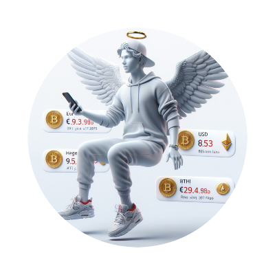

# Hermes: Empowering agEUR Holders with Real-time Insights

--------------

# Challenge

- In the dynamic world of decentralized finance, the agEUR stablecoin, backed by [Angle Protocol](https://www.angle.money/), has gained substantial adoption from a global community exceeding one million users. This widespread adoption is attributed to its over-collateralization, ensuring stability and reliability. However, despite its popularity, agEUR holders face a challenge – the lack of a comprehensive system that keeps them informed about essential details such as credits, debits, balances, as well as more advanced updates like liquidity and arbitrage opportunities, fluctuation insights, swap possibilities, and open positions on decentralized exchanges (DEXs).

Currently, a significant portion of agEUR holders remains unaware of the diverse opportunities and the "quality of hodl" features that could enhance their financial strategies. Recognizing this gap, **Hermes** steps in to bridge the information divide.

# Solution

- Hermes is a user-friendly notification system designed to seamlessly integrate with the wallets of agEUR holders. The primary function of this system is to monitor all relevant activities within the wallet associated with agEUR. This includes transactions, balances, and other pertinent details. Moreover, Hermes extends its monitoring capabilities to DEXs and protocols where agEUR is actively traded. The system scans for potential opportunities that could prove advantageous for agEUR holders, such as arbitrage possibilities and favorable swap conditions.

In addition to blockchain-centric monitoring, Hermes acknowledges the significance of real-world developments. Given that agEUR is a stablecoin pegged to fiat currency, the system keeps a vigilant eye on fiat news to provide users with up-to-date exchange rates.

# Why it Matters

- ## Real-time Awareness
  
Hermes ensures that agEUR holders remain informed about activities within their wallets without the need for constant manual checks. This proves particularly valuable in situations such as security breaches, as users can promptly respond to real-time updates and take immediate action.

- ## Informed Financial Decision-Making

The insights provided by Hermes empower agEUR holders to make well-informed financial decisions. Whether it's identifying arbitrage opportunities, managing liquidity, executing swaps, navigating bridges between protocols, or monitoring open positions on DEXs, users can leverage this information for strategic advantage.

- ## Market Flexibility

By monitoring fiat markets for price updates, Hermes equips holders with the ability to respond promptly to market fluctuations. In the event of prices falling below a user's preferred threshold, they can make timely decisions to convert or withdraw their funds.

In essence, Hermes serves as a critical tool for agEUR holders, offering a comprehensive and accessible solution to stay connected with the evolving landscape of decentralized finance while enhancing their financial decision-making capabilities.

----

## Resources
- [Angle](https://www.angle.money/)
- [Angle Docs](https://docs.angle.money/overview/readme)
- [Angle Blog](https://www.angle.money/blog)
- [Angle Whitepaper](https://docs.angle.money/overview/whitepapers)